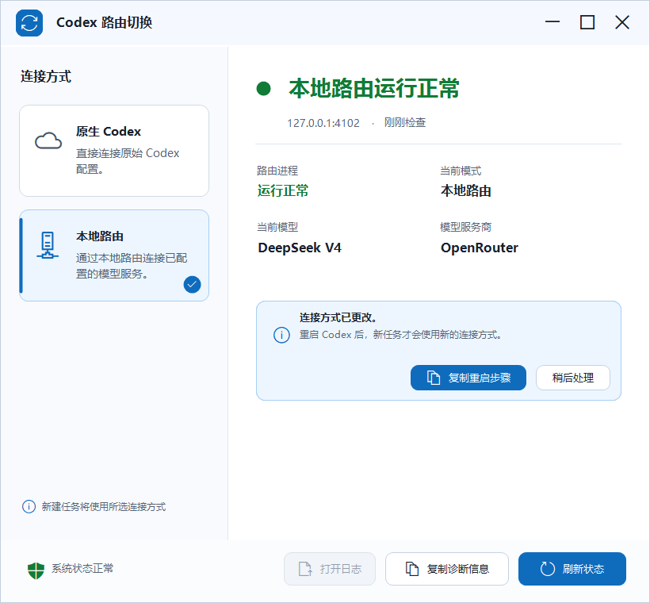

# Codex Router Switch

这是一个使用 Windows 原生 .NET Framework 编译的轻量控制面板，用于在以下两种
Codex 连接方式之间安全切换：

- **原生 Codex**：移除 Router 托管配置，恢复原生 Codex。
- **本地路由**：启用 Codex Router 配置，重新生成仓库官方的
  `%USERPROFILE%\.codex\codex-router\start-codex-router.cmd`，并在可见命令窗口中启动它。

界面将“用户选择的连接模式”和“Router 实际运行健康状态”分开显示，避免仅凭一个
ON/OFF 拨杆误判当前是否可用。



OFF 不会删除以下内容：

- OpenRouter 等供应商凭据；
- 已启用供应商和自定义模型设置；
- Router 日志、缓存、备份和安装目录；
- Codex 的 ChatGPT 登录、profiles、MCP 和其他非 Router 设置。

## 主界面

v1.2 使用纯中文的现代 Windows 界面，采用自绘圆角按钮、模式选择项、标题栏和固定
底部命令栏，不依赖第三方 UI 框架。主界面显示：

- 当前连接模式：原生 Codex 或本地路由；
- Router 健康状态和本地端口；
- 当前模型及模型服务商；
- 最近一次状态检查时间；
- 降级和未跟踪进程状态的针对性恢复操作；
- Router 日志入口和不含凭据的诊断报告；
- 切换完成后的 Codex 重启提示；
- 窗口处于活动状态时每 5 秒自动刷新状态。

内部状态 `Degraded` 表示 Codex 已配置为使用 Router，但 Router 健康检查失败。
内部状态 `Orphaned` 表示原生 Codex 已恢复，但端口 `4102` 上仍检测到一个不受本程序管理的
Router 进程。程序不会自动终止未知进程。

## 前提

- Windows 10/11；
- 已安装并完成配置的
  [duolahypercho/codex-router](https://github.com/duolahypercho/codex-router)；
- Codex Router 默认位于 `%LOCALAPPDATA%\codex-router`，Codex 配置默认位于
  `%USERPROFILE%\.codex`；
- Node.js 可用，或者已由 Codex/Hermes 提供本机 Node.js。

如安装位置不同，可在启动程序前设置
`CODEX_ROUTER_SWITCH_ROUTER_ROOT` 和 `CODEX_ROUTER_SWITCH_CODEX_HOME`。
本项目不会索取、保存或上传供应商 API Key。

## 使用

直接双击：

`dist\CodexRouterSwitch.exe`

也可以双击兼容启动器：

`Open-Codex-Router-Switch.cmd`

每次切换完成后，需要完全退出并重新打开 Codex App。程序不会自动终止或重启 Codex，
以免中断正在运行的任务。界面可将重启步骤复制到剪贴板。

本地路由运行时会出现一个标题为 `Codex Router - Visible Console` 的命令窗口。
请在使用期间保留该窗口；需要停止时在控制面板中选择原生 Codex。

## 安全设计

- EXE 使用 Windows 自带的 .NET Framework 编译，不依赖 PS2EXE 或第三方 GUI 模块。
- 使用按当前 Windows 用户隔离的单实例互斥锁，避免同时打开多个控制面板造成 PID
  状态竞争。
- 恢复 Native Codex 时先恢复配置；只有恢复成功后才停止 Router，避免 Codex 指向
  已停止的本地端点。
- 不调用仓库的完整 `enable` 安装流程，因此切换时不会重复运行 `npm ci` 或重新安装
  Python 依赖。
- 启用 Router 使用仓库自身的 `catalog.mjs`、`config-manager.mjs` 和
  `service-windows.mjs render`。
- 恢复 Native Codex 使用仓库自身的 `config-manager.mjs disable` 和
  `service.mjs uninstall`。
- 仅终止本程序记录并验证过的可见命令窗口进程树；不会根据端口粗暴终止未知进程。
- 如果端口 `4102` 被未知 Router 进程占用，程序会停止切换并显示 Orphaned/异常状态，
  而不是杀死无关进程。
- Router 启动失败时，如果原先是 Native Codex，会自动回滚到原生配置。
- 诊断报告不包含 API Key、OAuth Token、供应商凭据或完整 managed capability URL，
  并将用户目录替换为 `%USERPROFILE%`。
- 界面支持键盘焦点、窗口缩放，并启用 Per-Monitor DPI 感知。
- 主界面的可见文案、辅助功能名称、剪贴板步骤和诊断报告均为中文；Codex、
  OpenAI、OpenRouter、模型名和路径等品牌或技术值保留原文。

EXE 没有商业代码签名证书，因此 Windows 属性中会显示“未签名”。它是在本机从
`src\CodexRouterSwitch.cs`、`src\ModernUiControls.cs` 和
`src\EnhancedMainForm.cs` 编译生成的；可使用
`Build-Exe.ps1` 复现构建。

## 重新编译

```powershell
powershell.exe -NoProfile -ExecutionPolicy Bypass `
  -File .\Build-Exe.ps1
```

构建脚本显式选择唯一的 `CodexRouterSwitch.EnhancedProgram` 入口，由该入口直接处理
GUI、状态读取和只读自检；路由控制器与进程安全边界保持不变。生成文件的程序集版本为
`1.2.2.0`。入口会在当前程序进程内将可能重复的 `Path` / `PATH` 收敛为单一
`PATH`，兼容由 Codex、IDE 或其他启动器继承的异常环境块；不会修改 Windows 用户或
系统环境变量。

## 只读自检

下面的命令只检查脚本、Node.js、当前 Codex 配置和官方启动脚本渲染，不切换状态：

```powershell
powershell.exe -NoProfile -ExecutionPolicy Bypass `
  -File .\CodexRouterSwitch.ps1 -Mode SelfTest
```

完整测试会：

- 解析 PowerShell 脚本；
- 验证仓库提交的 `dist\CodexRouterSwitch.exe` 确实使用增强版界面；
- 编译增强版 EXE；
- 验证现代中文 GUI、圆角自绘控件和关键布局可在不显示窗口、不改变配置的情况下实例化；
- 验证 EXE 仍可调用原控制器的只读自检；
- 在 `work/test_outputs/` 下创建隔离的临时 Codex 配置；
- 验证 enable/disable 保留原生模型、provider 和 profile；
- 不修改真实的 `%USERPROFILE%\.codex\config.toml`。

```powershell
powershell.exe -NoProfile -ExecutionPolicy Bypass `
  -File .\Test-CodexRouterSwitch.ps1
```

## 许可证

当前仓库尚未附加开源许可证。公开可见不等同于授予复制、修改或再分发许可。
