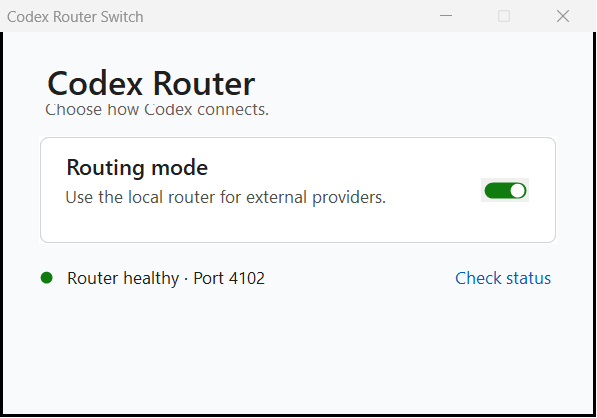

# Codex Router Switch

这是一个已编译为单文件 Windows EXE 的拨杆式开关，用于在以下两种状态之间切换：



- **ON**：启用 Codex Router 配置，重新生成仓库官方的
  `%USERPROFILE%\.codex\codex-router\start-codex-router.cmd`，并在可见命令窗口中启动它。
- **OFF**：停止由本程序启动的 Router 进程，移除 Router 托管配置和后台计划任务，
  恢复原生 Codex。

OFF 不会删除以下内容：

- OpenRouter 等供应商凭据；
- 已启用供应商和自定义模型设置；
- Router 日志、缓存、备份和安装目录；
- Codex 的 ChatGPT 登录、profiles、MCP 和其他非 Router 设置。

## 前提

- Windows 10/11；
- 已安装并完成配置的
  [duolahypercho/codex-router](https://github.com/duolahypercho/codex-router)；
- Codex Router 默认位于 `%LOCALAPPDATA%\codex-router`，Codex 配置默认位于
  `%USERPROFILE%\.codex`；
- Node.js 可用，或者已由 Codex/Hermes 提供本机 Node.js。

如安装位置不同，可在启动程序前设置
`CODEX_ROUTER_SWITCH_ROUTER_ROOT` 和 `CODEX_ROUTER_SWITCH_CODEX_HOME`。
本项目不会索取、保存或上传供应商 API Key。

## 使用

直接双击：

`dist\CodexRouterSwitch.exe`

也可以双击兼容启动器：

`Open-Codex-Router-Switch.cmd`

每次切换完成后，需要由你自己完全退出并重新打开 Codex App。程序不会自动重启
Codex。

主界面会显示当前运行状态和 Router 端口；`Check status` 只执行只读检查。成功切换后，
界面底部才会显示 `Restart Codex to apply this change.` 提示，不再用成功弹窗打断操作。
失败和需要注意的警告仍会使用 Windows 消息框明确提示。

ON 时会出现一个标题为 `Codex Router - Visible Console` 的命令窗口。请在 Router
使用期间保留该窗口；需要停止时使用拨杆切换到 OFF。

## 安全设计

- EXE 使用 Windows 自带的 .NET Framework 编译，不依赖 PS2EXE 或第三方 GUI 模块。
- 使用按当前 Windows 用户隔离的单实例互斥锁，避免同时打开多个开关造成 PID
  状态竞争。
- OFF 会先恢复原生 Codex 配置；只有恢复成功后才停止 Router，避免 Codex 指向已停止
  的本地端点。
- 不调用仓库的完整 `enable` 安装流程，因此切换时不会重复运行 `npm ci` 或重新安装
  Python 依赖。
- ON 使用仓库自身的 `catalog.mjs`、`config-manager.mjs` 和
  `service-windows.mjs render`。
- OFF 使用仓库自身的 `config-manager.mjs disable` 和 `service.mjs uninstall`。
- 仅终止本程序记录并验证过的可见命令窗口进程树；不会根据端口粗暴终止未知进程。
- 如果端口 `4102` 被未知 Router 进程占用，程序会报错并停止，而不是杀死无关进程。
- ON 启动失败时，如果原先是原生 Codex，会自动回滚到原生配置。
- 界面支持键盘焦点和空格键/回车键切换，并启用 Per-Monitor DPI 感知。

EXE 没有商业代码签名证书，因此 Windows 属性中会显示“未签名”。它是在本机从
同目录的 `src\CodexRouterSwitch.cs` 编译生成的；可使用 `Build-Exe.ps1` 复现构建。

## 重新编译

```powershell
powershell.exe -NoProfile -ExecutionPolicy Bypass `
  -File .\Build-Exe.ps1
```

## 只读自检

下面的命令只检查脚本、Node.js、当前 Codex 配置和官方启动脚本渲染，不切换状态：

```powershell
powershell.exe -NoProfile -ExecutionPolicy Bypass `
  -File .\CodexRouterSwitch.ps1 -Mode SelfTest
```

完整测试还会在 `work/test_outputs/` 下创建隔离的临时 Codex 配置，验证
enable/disable 是否保留原生模型、provider 和 profile；它不会修改真实的
`%USERPROFILE%\.codex\config.toml`：

```powershell
powershell.exe -NoProfile -ExecutionPolicy Bypass `
  -File .\Test-CodexRouterSwitch.ps1
```

## 许可证

当前仓库尚未附加开源许可证。公开可见不等同于授予复制、修改或再分发许可。
